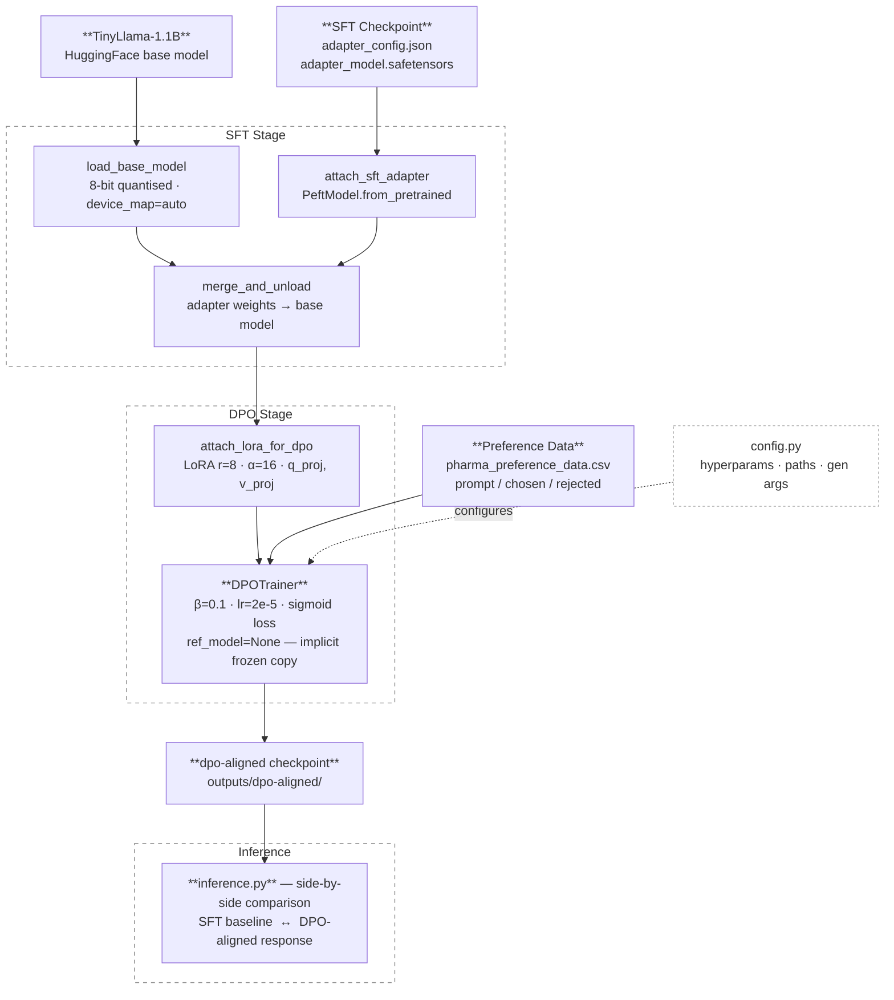

# domain-specific-pharma-llm-assistant

Fine-tunes **TinyLlama-1.1B** with **Direct Preference Optimisation (DPO)** to improve response quality in the pharmaceutical / drug-discovery domain.

The pipeline starts from an instruction-tuned checkpoint, merges its LoRA adapter into the base weights, then trains a fresh LoRA with DPO on human preference pairs (chosen vs. rejected responses).

---

## Project Structure

```
Pharma-LLM/
├── config.py          # All hyperparameters and file paths — edit here first
├── model_utils.py     # Tokenizer / model loading helpers
├── data_utils.py      # Preference dataset loading & validation
├── train.py           # DPO training entry point
├── inference.py       # Side-by-side SFT vs DPO comparison
├── requirements.txt
├── checkpoints/
│       ├── adapter_config.json
│       └── adapter_model.safetensors
└── data/
    └── pharma_preference_data.csv   # <-- place your CSV here
```
## System architecture


---

## Setup

```bash
pip install -r requirements.txt
```

GPU with ≥ 16 GB VRAM recommended (8-bit quantisation is used during training).

---

## Quick Start

### 1. Prepare your data

Place `pharma_preference_data.csv` in `data/`.  
Required columns: `prompt`, `chosen`, `rejected`.

### 2. Set paths in `config.py`

```python
INSTRUCTION_CKPT_DIR = "./checkpoints/instruction-tuned"  # your SFT checkpoint
PREFERENCE_DATA_CSV  = "./data/pharma_preference_data.csv"
```

### 3. Train

```bash
python train.py
```

Aligned model is saved to `./outputs/dpo-aligned`.

### 4. Evaluate

```bash
python inference.py
# or with a custom prompt:
python inference.py --prompt "What is the role of AI in clinical trials?"
```

---

## Key Design Decisions

| Decision | Why |
|---|---|
| 8-bit quantisation | Fits training into ≤ 16 GB VRAM without precision loss |
| Merge SFT adapter before DPO | Avoids nested PEFT; gives DPO a clean parameter space |
| `ref_model=None` | TRL implicitly uses a frozen copy — saves VRAM |
| `remove_unused_columns=False` | Keeps all CSV columns so DPO loss computation doesn't break |
| `WANDB_DISABLED=true` | Removes external dependency for clean local runs |

---

## References

- Rafailov et al., *Direct Preference Optimization* (2023)  
- [TRL DPOTrainer docs](https://huggingface.co/docs/trl/dpo_trainer)  
- [TinyLlama](https://huggingface.co/TinyLlama/TinyLlama-1.1B-intermediate-step-1431k-3T)
